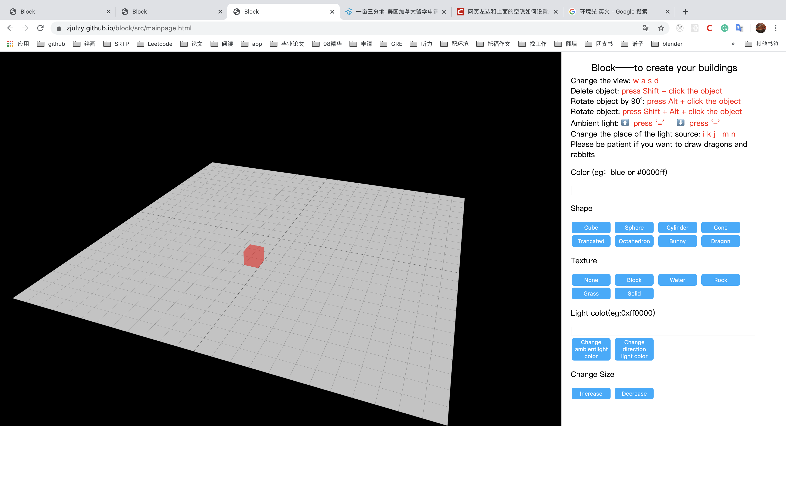

# Block

play it [here](https://zjulzy.github.io/block/src/mainpage.html)!

:warning:打开之后要确认以下几点：

1. **缩放页面大小**，缩放页面大小后，理想中的显示效果如下：

2. 确保此时用的是**英文输入法**，不然接下来的按键操作将全部失效

3. 建议**打开页面后先调整一下环境光，按’-’减弱环境光**，这样会使效果更加明显。

  

:four_leaf_clover:**键盘对应的功能**

​       删除物体：按住Shift再用鼠标点击想删除的物体

​       物体旋转90°：按住Alt再点击想让其旋转的物体

​       动画旋转效果：同时按住Shift+Alt再点击想让其动画旋转的物体（旋转过程中必须始终按住Shift+Alt） 

​       减弱环境光：按住’-’

​       增强环境光：按住’+’

​       改变光源位置：i k j l n m 

​       转换视点：w a s d 

:four_leaf_clover:**其他注意事项**

​       1. 在输入体素的颜色的时候，可以直接输入颜色名，也可以用#之后跟上相应的RGB值来指定颜色例如#00ffff。可以在这个网站上查看支持的颜色名字<http://www.w3school.com.cn/cssref/css_colornames.asp> 

​       2. 在编辑光源颜色的时候，输入颜色的格式必须是0x之后跟上相应的RGB值，例如0x00ffff

:cherry_blossom:**可以实现的简单效果**

